# 2 Création des composants statiques

- Dans cette étapes nous allons créer les composant que nous avons besoin dans notre projet

---

## 1- Le découpage

- Maintenant nous allons découper notre page web en diférent compsant

### Voici des exemple de découpage

- Rappel des différences entre HTML4 & 5.

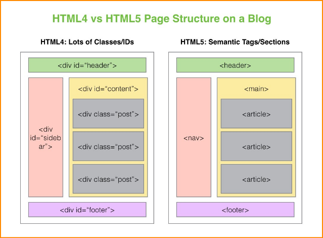
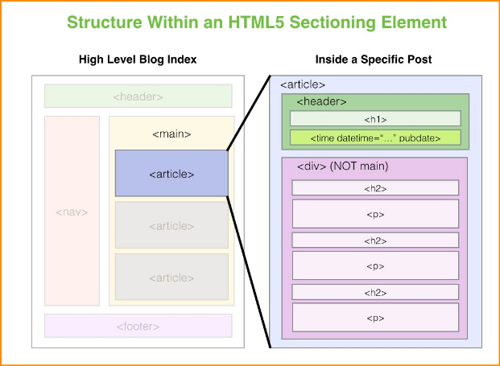

- La bonne pratique
  
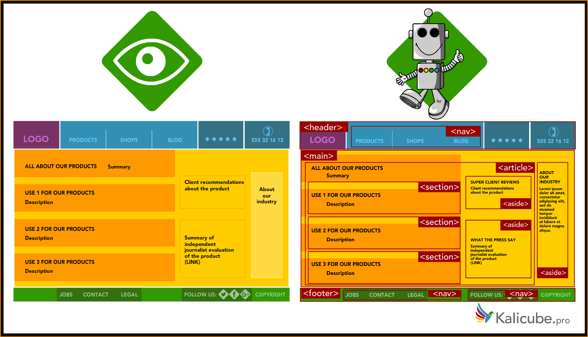

- Découpe simple
  
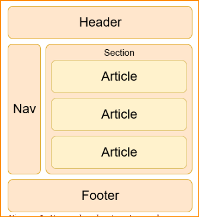
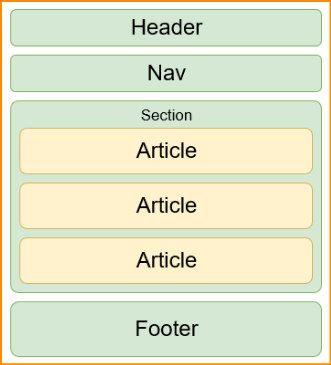
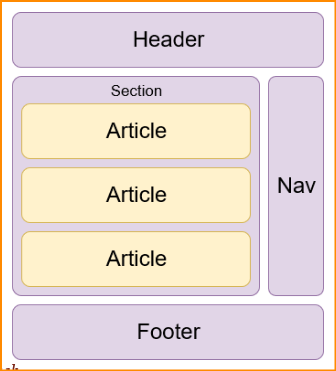


- Autre découpes

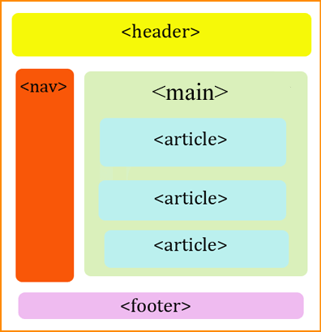
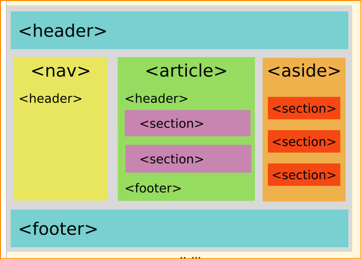
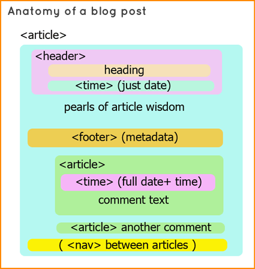

- Autre découpes détaillées

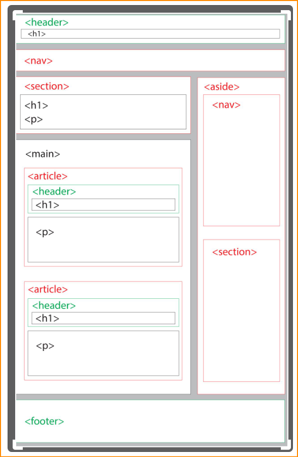
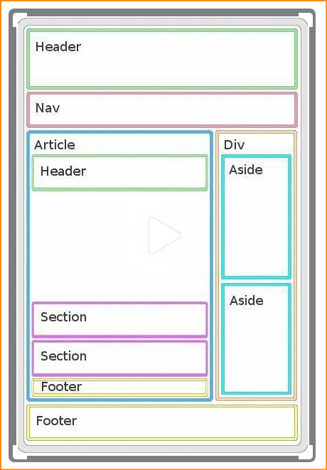
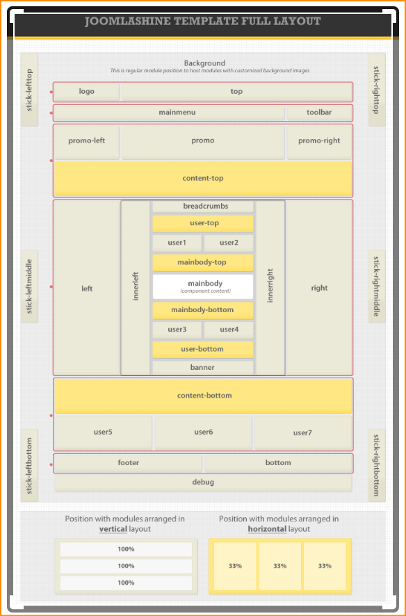

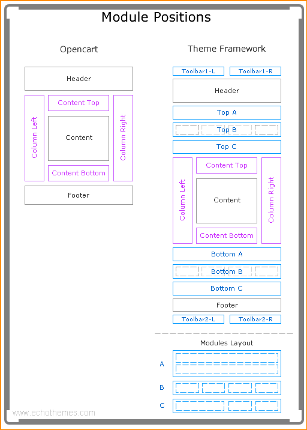

---

## 2 Création des Composants

### 2-1 Création du composant principal

Nous allons créer notre composant principal **le plus important**. il y aura tous les liens des composants et même des fonctions et les states

#### 2-1-1 Création d'un dossier et des fichiers principaux

Se que nous aurons besoins pour notre App dans le dossier `src/components/`

Soit :

- Pour le dossier
  
`MonApp/src/components/MonDossierRoot`

- Pour les Fichier

`MonApp/src/components/MonDossierRoot/index.js`

`MonApp/src/components/MonDossierRoot/styles.scss`

#### 2-1-2 Remplissage des fichiers du compo principal

On vas remplire notre fichier 
`MonApp/src/components/MonDossierRoot/index.js`

```js
// == Import npm
import React from 'react';

// == Import
import './styles.scss';

// == Composant
const MonDossierRoot = () => (
  <div className="mondossierroot">
    <h1>Composant : MonDossierRoot</h1>
  </div>
);

// == Export
export default MonDossierRoot;
```

#### 2-1-3 Le style

- Création du fichier styles suivant ses besoins

Voir les fichiers CSS et SCSS

#### 2-1-4 Modification de index.js

Pour afficher notre composant nous devons modifier le fichier que nous importons affin qu'il s'affiche

Dans `src/components/index.js`

Modifier APP par `MonDossierRoot`
Version initial

```js
// == Import : npm
import React from 'react';
import { render } from 'react-dom';

// == Import : local
// Composants
import App from 'src/components/App';
   
// == Render
// 1. Élément React racine (celui qui contient l'ensemble de l'app)
//    => crée une structure d'objets imbriqués (DOM virtuel)
const rootReactElement = <App />;
// 2. La cible du DOM (là où la structure doit prendre vie dans le DOM)
const target = document.getElementById('root');
// 3. Déclenchement du rendu de React (virtuel) => DOM (page web)
render(rootReactElement, target);
```

Version Modifier

```js
// // == Import : npm
// import React from 'react';
// import { render } from 'react-dom';
// 
// // == Import : local
// // Composants
   import MonDossierRoot from 'src/components/MonDossierRoot';
// 
// // == Render
// // 1. Élément React racine (celui qui contient l'ensemble de l'app)
// //    => crée une structure d'objets imbriqués (DOM virtuel)
   const rootReactElement = <MonDossierRoot />;
// // 2. La cible du DOM (là où la structure doit prendre vie dans le DOM)
// const target = document.getElementById('root');
// // 3. Déclenchement du rendu de React (virtuel) => DOM (page web)
// render(rootReactElement, target);
```

#### 2-1-5 Supprssion de APP

Après avoir créer notre composant nous pouvons supprimer le composant d'exemple `APP`

---

### 2-2 Création des compsants secondaires 

Maintenant on vas créer les composants secondaires pour cela on vas découper notre pas web en élément comme dans les exemples vue plus haut, nous avons besoin en général d'un Header, Nav, Main,  Articles, Aside, Section, Footer

#### 2-2-1 Création des éléments 

Dans le fichier `src/MonDossierApp/index.js` nous allons intégrer les éléments que nous aurons besoins

Version initial

```js
// == Import npm
import React from 'react';

// == Import
import './styles.scss';

// == Composant
const MonDossierApp = () => (
  <div className="github-api">
    <h1>Composant : MonDossierApp</h1>
  </div>
);

// == Export
export default MonDossierApp;
```

Version Final

```js
// // == Import npm
// import React from 'react';
// 
// // == Import
// import './styles.scss';
// 
// // == Composant
// const MonDossierApp = () => (
//   <div className="github-api">
//     <h1>Composant : MonDossierApp</h1>
       <h1>Composant : MonCompoSecondaire</h1>
       <h1>Composant : Header</h1>
       <h1>Composant : Nav</h1>
       <h1>Composant : Main</h1>
       <h1>Composant : Articles</h1>
       <h1>Composant : Aside</h1>
       <h1>Composant : Section</h1>
       <h1>Composant : Footer</h1>
//   </div>
// );

// == Export
// export default MonDossierApp;
```

#### 2-2-1 Création des dossiers & fichiers

comme vue plus haut c'est la même opération on vas créer les Dossiers des composants avec a l'intérieur un index.js et un styles.scss

dans les compo secondaire `src/components/MonCompoSecondaire`

Soit :

- Pour le dossier
  
`MonApp/src/components/MonCompoSecondaire`

- Pour les Fichier

`MonApp/src/components/MonCompoSecondaire/index.js`

`MonApp/src/components/MonCompoSecondaire/styles.scss`

intégration dans src/Header/index.js

```js
// == Import npm
import React from 'react';

// == Import
import './styles.scss';

// == Composant
const Header = () => (
  <div className="header">
    <h1>Composant : Header</h1>
  </div>
);

// == Export
export default Header;
```

puis on import notre fichier dans le `src/components/MonDossierApp/index.js`

```js
import Header from 'src/components/Header'
```

Et on modifie la ligne

```js
<h1>Composant : Header</h1>
```

en

```js
< Header />
```

Puis on fait cela pour tous les composants que nous avons besoins.

Soit dans notre fichier  `src/components/MonDossierApp/index.js` au final

```js
// // == Import npm
   import React from 'react';
   import MonCompoSecondaire from 'src/components/MonCompoSecondaire'
   import Header from 'src/components/Header'
   import Nav from 'src/components/Nav'
   import Main from 'src/components/Main'
   import Articles from 'src/components/Articles'
   import Aside from 'src/components/Aside'
   import Section from 'src/components/Section'
   import Footer from 'src/components/Footer'
// 
// // == Import
// import reactLogo from './react-logo.svg';
// import './styles.scss';
// 
// // == Composant
// const MonDossierApp = () => (
//   <div className="mondossierapp">
//     
//     <h1>Composant : Mon Dossier App</h1>
       < MonCompoSecondaire />
       < Header />
       < Nav />
       < Main />
       < Articles />
       < Aside />
       < Section />
       < Footer />
//   </div>
// );
// 
// // == Export
// export default MonDossierApp;
```
---

Dans ce model de React les parties ci-dessus sont déjà faite.

```js
```

```js
```


```js
```

```js
```

```js
```

```js
```

```js
```

```js
```

```js
```

```js
```

```js
```

```js
```

```js
```

```js
```

```js
```

```js
```

```js
```

```js
```

```js
```

```js
```

```js
```

```js
```

```js
```

```js
```

```js
```

```js
```

```js
```

```js
```

```js
```

```js
```

```js
```

```js
```
